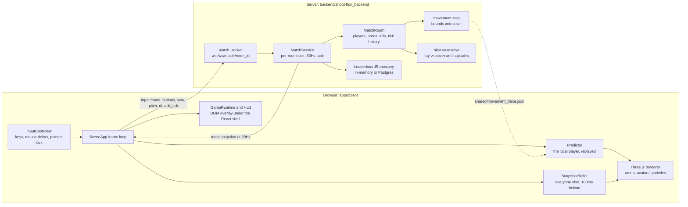
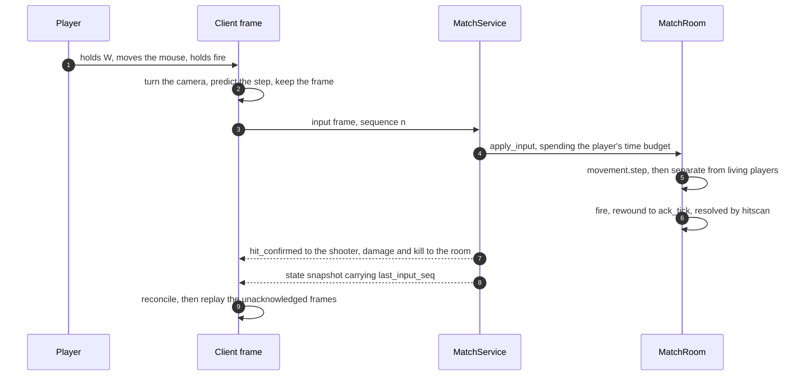
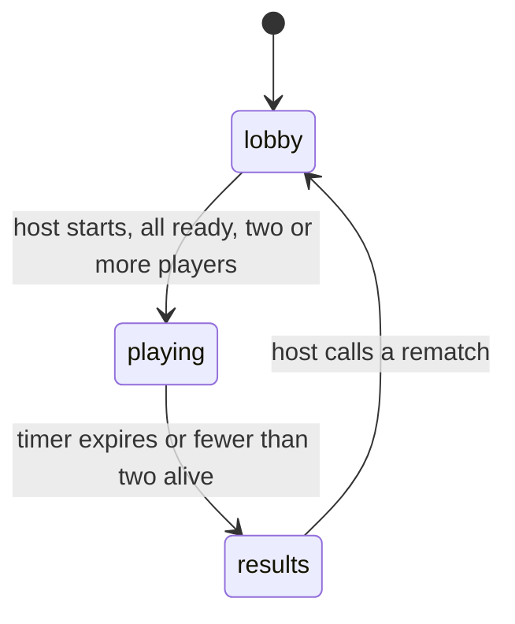

# Shoot4Fun architecture

> The server runs the match. The client draws it, predicts its own
> player, and sends nothing but intent. The decisions behind that shape
> are in `docs/adr/`: `0002` first-person perspective, `0003` the
> authoritative simulation and the intent protocol, `0004` client
> prediction and the shared movement trace.

## The shape



The two boxes are the two processes. The only line from the browser
into the server carries an input frame, and the only line back carries a
room snapshot. The dotted line is not traffic: it is the generated
fixture that holds the server's movement routine and the client's mirror
of it in agreement (`ADR-0004`).

## One frame, end to end



Look angles are applied to the camera before anything is sent, so aim
never waits for a round trip. Position is predicted locally and
corrected by the next snapshot: when both sides agree, the correction is
zero and nothing moves on screen.

## Rates and bounds

| Quantity | Value | Where |
| --- | --- | --- |
| Simulation tick | 60Hz | `match_room.SIM_TICK_HZ` |
| Snapshot broadcast | 20Hz | `match_room.SNAPSHOT_HZ` |
| Interpolation delay | 100ms | `SnapshotBuffer.INTERPOLATION_DELAY_MS` |
| Longest claimed frame | 0.05s | `movement.MAX_FRAME_DT` |
| Banked simulation time | 0.25s | `player.MAX_SIM_BUDGET_SECONDS` |
| Furthest rewind for a shot | 30 ticks | `match_room.MAX_REWIND_TICKS` |
| Position history kept | 60 ticks | `match_room.HISTORY_TICKS` |
| Walk speed | 6 m/s | `movement.MOVE_SPEED` |
| Room capacity | 4 players | `match_room.ROOM_CAPACITY` |
| Match duration | 480s | `match_room.MATCH_DURATION_SECONDS` |

## What each module owns

| Module | File | Owns |
| --- | --- | --- |
| WebSocket endpoint | `backend/.../adapters/inbound/websocket/match_socket.py` | The hello handshake, the `ROOM_FULL` close, message dispatch. |
| Match service | `backend/.../application/services/match_service.py` | The 60Hz task, the per-room lock, the broadcast cadence, announcements. |
| Match room | `backend/.../domain/model/match_room.py` | Players, arena, kills, timer, tick history, respawn placement. |
| Movement | `backend/.../domain/model/movement.py` | Position in, intent in, next position out. Pure. |
| Hitscan | `backend/.../domain/model/hitscan.py` | Ray versus cover boxes and player capsules, headshots. |
| Input frame | `backend/.../domain/model/input_frame.py` | Parsing and coercing one client frame. |
| Player | `backend/.../domain/model/player.py` | Health, ammunition, reload, weapon, simulation budget. |
| Leaderboard | `backend/.../adapters/outbound/{memory,postgres}/` | Best score per arena, upsert-if-higher. |
| Scene | `apps/client/src/scene/SceneApp.ts` | Renderer, camera rig, arena meshes, avatars, frame loop. |
| Prediction | `apps/client/src/sim/Predictor.ts` | Local position, pending frames, reconciliation. |
| Interpolation | `apps/client/src/sim/SnapshotBuffer.ts` | Other players, sampled 100ms in the past. |
| Client movement | `apps/client/src/sim/movement.ts` | The mirror of the server routine. |
| Input | `apps/client/src/input/InputController.ts` | Held keys, mouse deltas, the pointer-lock lifecycle. |
| Socket | `apps/client/src/net/MatchClient.ts` | The connection and message dispatch. |
| Runtime boundary | `apps/client/src/app/GameRuntime.ts` | The one door between the imperative half (scene, socket, HUD) and React. Publishes plain data. |
| HUD | `apps/client/src/ui/hud/Hud.ts` | Crosshair, health, ammo, score, hit feedback, respawn countdown. Written per snapshot, never through a component tree. |
| Screens | `apps/client/src/ui/views/` | Entry, lobby, results, settings and the pointer-lock gate, as atoms through pages. |
| Screen state | `apps/client/src/ui/viewmodels/` | Session, room, settings and leaderboard, as state/actions/model triples. |

## The one duplicated routine

`movement.step` exists twice, in Python and in TypeScript, and the two
are held in agreement by a generated fixture rather than by review
(`ADR-0004`).

```
backend/scripts/generate_movement_trace.py   writes  shared/movement_trace.json
backend/tests/unit/domain/test_movement_trace.py     replays it in Python
apps/client/src/sim/movement.test.ts                 replays it in TypeScript
```

Changing a movement rule or arena datum means regenerating the trace:

```sh
cd backend && python scripts/generate_movement_trace.py
```

Both suites fail, naming the first differing step, when a change lands
on one side only.

## Wire protocol

Client to server, all JSON over `/ws/match/{room_id}`:

| Message | Payload |
| --- | --- |
| `hello` | `name` |
| `input` | `seq`, `dt`, `ack_tick`, `buttons.{forward,back,left,right,fire}`, `yaw`, `pitch` |
| `set_ready` | `ready` |
| `select_map` | `arena` (host only, lobby only) |
| `start_match` | host only, all ready, two or more players |
| `rematch` | host only, results only |
| `switch_weapon` | `weapon` |
| `reload` | none |
| `ping` | `t` |

Server to client:

| Message | Payload |
| --- | --- |
| `hello` | `player_id`, `room` |
| `lobby_state`, `match_started`, `state`, `results` | `room` snapshot |
| `player_joined`, `player_left` | `player` / `player_id` |
| `respawn` | `player_id` |
| `hit_confirmed` | `victim`, `damage`, `headshot`, `killed` (shooter only) |
| `damage` | `victim`, `attacker`, `damage`, `point` |
| `kill` | `killer`, `victim`, `headshot` |
| `error` | `code` (`BAD_HELLO`, `BAD_JSON`, `ROOM_FULL`), `detail` |
| `pong` | `t` |

A room snapshot carries the room id, the arena layout, the state, the
host id, the simulation `tick`, every player (position, look, hit
points, ammunition, kills, deaths, `last_input_seq`), the kill totals,
the winner and the time remaining.

## Match lifecycle



`MatchStateMachine` holds the table and raises on any other transition.
Ready-up is accepted in the lobby only; input, hit points and the kill
counter move in the playing state only.

## Concurrency

- One `asyncio` task runs the simulation for every room, sleeping the
  remainder of each 60Hz budget so a slow tick does not compound.
- Every handler and the tick take the room's `asyncio.Lock` before
  mutating state and release it before awaiting network I/O.
- The `Broadcaster` is the only route from locked state to the wire.

## HTTP surface

| Route | Purpose |
| --- | --- |
| `GET /api/health` | Liveness and version. |
| `GET /api/arenas` | The arenas a room can be set to, with the lobby's display copy. The picker is built from this, so the client carries no list of maps. |
| `GET /api/leaderboard/{arena}` | Best score for an arena, 404 when there is none. |
| `POST /api/leaderboard/{arena}/score` | Upsert-if-higher, body `{holder_name, score}`. |

`Container` selects the Postgres leaderboard when `DATABASE_URL` is set
and the in-memory one otherwise, and starts the tick unless
`DISABLE_TICK_LOOP=1`.

## Brand and tokens

Every UI element reads the brand tokens (`docs/brand.md`,
`apps/client/src/brand/theme.css`, `apps/client/src/brand/tokens.ts`).
A non-token colour anywhere in the build is a defect.

## Gates

| Gate | Command |
| --- | --- |
| Backend | `cd backend && python -m pytest -q && python -m ruff check .` |
| Client | `cd apps/client && npx tsc --noEmit && npm test` |
| End to end | `cd apps/client && npx playwright test` |
| Intent audit | `csd-intent .` |

`.github/workflows/test.yml` runs the first three on every push and pull
request; `.github/workflows/build.yml` calls the platform's shared build
workflow.

## Deployment

The PSA Foundry hosts the app. The two-image shape (server and client)
is the per-component binding the platform's image updater writes to the
deploy branch on every new image tag.

| Concern | Source |
| --- | --- |
| CI build and push | `.github/workflows/build.yml` |
| Backend image | `backend/Dockerfile` |
| Client image | `apps/client/Dockerfile` |
| Docs image | `docs/Dockerfile` |
| Chart | `k8s/` |
| Onboarding | `platform-studio onboard_app` |
| Database grant | `platform-studio onboard_database` (mints `pg-app-shoot4fun`) |
